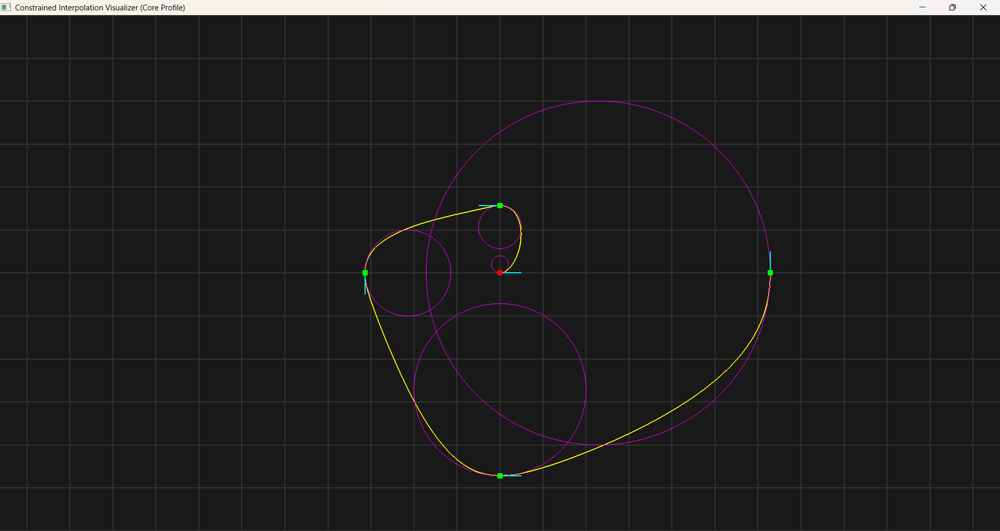
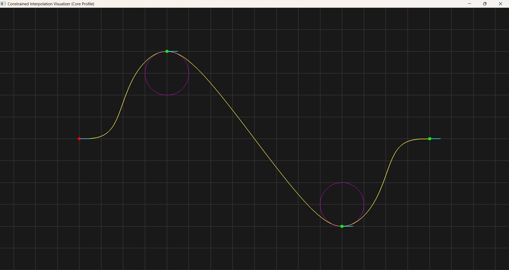
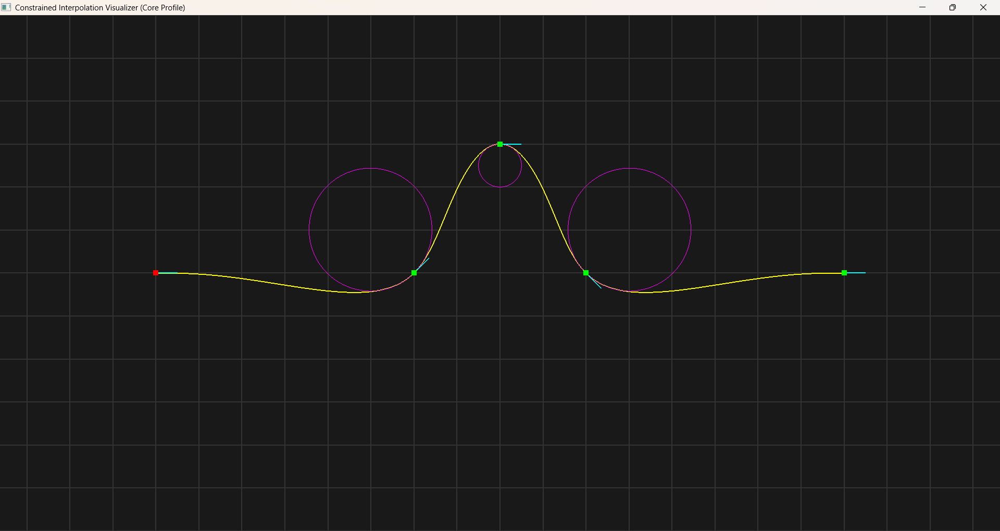

# Constrained Interpolation

## Overview

This project is a C++ implementation of  constrained interpolation using quintic Hermite splines, which enables the generation of highly smooth, C2 continuous curves that pass through a series of control points.

The key feature of this implementation is the ability to precisely constrain the **direction** and **curvature** at each individual control point, with the hope that it can be a useful tool for path planning in robotics, animation, and other engineering fields.

## Key Features

- **C2 Continuity**: The generated spline is twice continuously differentiable, ensuring a perfectly smooth path with no abrupt changes in acceleration.

- **Direction Constraints**: You can explicitly define the direction at each control point. The curve will pass through the point exactly in the specified direction.

- **Curvature Constraints**: You can explicitly define the curvature at each control point. This controls how "tight" the curve is at that point, allowing for the creation of sharp turns or wide, sweeping arcs.

## Examples

Here are a few examples of paths created with different constraints.

---

### 1. Spiral

**Sample Data:**
```cpp
std::vector<double> t = {0, 1, 2, 3, 4};
std::vector<double> x = {0.0, 0.0, -M_PI, 0.0, 2 * M_PI};
std::vector<double> y = {0.0, M_PI / 2, 0.0, -1.5 * M_PI, 0.0};
std::vector<double> direction = {0.0, 180.0, -90.0, 0.0, 90.0};
std::vector<double> curvature = {5.0, 2.0, 1.0, 0.5, 0.25};
```

**Result:**



---

### 2. S-curve

**Sample Data:**
```cpp
std::vector<double> t = {0, 1, 2, 3};
std::vector<double> x = {-8.0, -4.0, 4.0, 8.0};
std::vector<double> y = {0.0, 4.0, -4.0, 0.0};
std::vector<double> direction = {0.0, 0.0, 0.0, 0.0};
std::vector<double> curvature = {0.0, -1, 1, 0.0};
```

**Result:**



---

### 3. Obstacle Avoidance

**Sample Data:**
```cpp
std::vector<double> t = {0, 1, 2, 3, 4};
std::vector<double> x = {-8.0, -2.0, 0.0, 2.0, 8.0};
std::vector<double> y = {0.0, 0.0, 3.0, 0.0, 0.0};
std::vector<double> direction = {0.0, 45.0, 0.0, -45.0, 0.0};
std::vector<double> curvature = {0.0, 0.7, -2.0, 0.7, 0.0};
```

**Result:**



## Run the Example

You can build and run the example program to see these results yourself.

```bash
git clone https://github.com/0Jaeyoung0/ConstrainedInterpolation.git
cd ConstrainedInterpolation
mkdir build
cd build
cmake ..
cmake --build .
./ConstrainedInterpolation
```